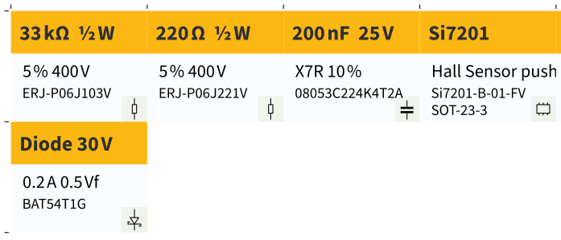
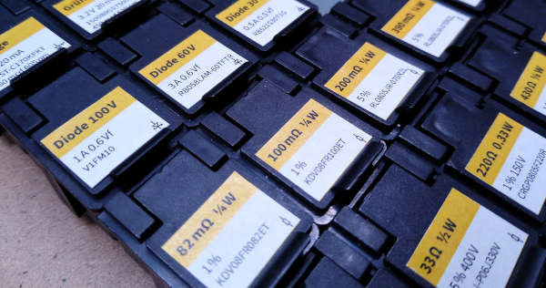

# SMD Labeler

Generates printable SVG labels for SMD boxes. Size fits [these boxes][ww-esd1].



When printed and cut, the result may look like this:



## Usage

Requires [Source Sans 3][ss3] installed on the system.

```ts
import { Sym } from '../src';
import SmdLabeler from '../src';

const data = [
    // Symbol like Ω will be auto-appended
    Sym.r( '33k', .5, 5, 400, 'ERJ-P06J103V' ),
    Sym.r( '220', .5, 5, 400, 'ERJ-P06J221V' ),
    
    // C gets a different icon
    Sym.c( '200n', 25, 10, 'X7R', '08053C224K4T2A' ),
    
    Sym.ic( 'Si7201', 'Hall Sensor push/pull', 'Si7201-B-01-FV', 'SOT-23-3' ),
    Sym.led( 'Green', 570, 2.2, 20, 45, 'LG R971-KN-1' ),
    Sym.led( 'Orange', 606, 2, 20, 45, 'LO R976-PS-1' ),
    
    // Generic symbol (plain text)
    '2→1 AND\n74AHCT1G08\nDBVRG4',
    'FET-N N-Ch 30 V\nIRLB8721PBF',
    Sym.fet( 'P', 1.2, 20, 0.45, 210, 'PM160UP,215' ),
    
    // Si and Schottky diodes
    Sym.d( 'Si', 1, 400, 1.1, 'FM4004-W' ),
    Sym.d( 'Sc', .2, 30, .5, 'BAT54T1G' ),
];

const labeler = new SmdLabeler();
labeler.saveSvg( data, 'output.svg' );
```

## Changelog

* v0.2.0 (2022-02-01): Add NPN, PNP, Darlington symbols and subscript support
* v0.1.0 (2022-01-20): Initial release

[ww-esd1]: https://www.reichelt.com/ch/de/esd-smd-klappbox-16-x-12-x-15-mm-deckel-schwarz-esd-box-1-sw-sw-p60405.html
[ss3]: https://github.com/adobe-fonts/source-sans
